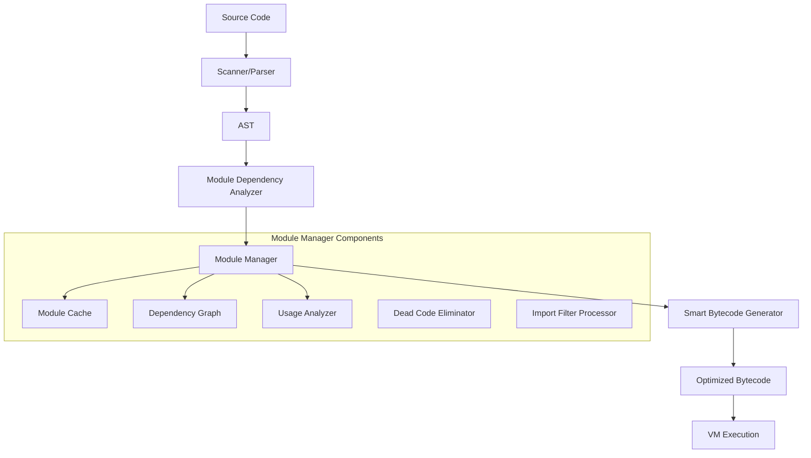

# Advanced Module System Design

## Overview

This design document outlines the architecture for refactoring the Limit programming language's module system to provide intelligent dependency resolution, bytecode optimization, and enhanced performance. The new system will feature a dedicated module manager, smart compilation strategies, and seamless integration with the existing VM architecture.

## Architecture

### High-Level Architecture



### Core Components

#### 1. Module Manager (`modules.hh/cpp`)

The central component responsible for all module-related operations:

```cpp
class ModuleManager {
public:
    // Core module operations
    ModulePtr loadModule(const std::string& modulePath);
    ModulePtr importModule(const ImportSpec& spec);
    void cacheModule(const std::string& path, ModulePtr module);
    
    // Dependency analysis
    DependencyGraph analyzeDependencies(const std::vector<std::string>& entryPoints);
    std::vector<std::string> getUsedSymbols(const std::string& modulePath);
    
    // Optimization
    BytecodePtr optimizeBytecode(const BytecodePtr& original, const UsageInfo& usage);
    void eliminateDeadCode(ModulePtr module, const std::set<std::string>& usedSymbols);
    
    // Import filtering
    ModulePtr applyImportFilter(ModulePtr module, const ImportFilter& filter);
    
private:
    ModuleCache cache_;
    DependencyAnalyzer analyzer_;
    DeadCodeEliminator optimizer_;
    std::unique_ptr<VM> vm_; // Friend access for VM operations
};
```

#### 2. Enhanced Module Representation

```cpp
struct Module {
    std::string path;
    std::string source;
    std::shared_ptr<AST::Program> ast;
    std::shared_ptr<Environment> environment;
    BytecodePtr bytecode;
    
    // Metadata for optimization
    std::set<std::string> exportedSymbols;
    std::set<std::string> usedSymbols;
    std::map<std::string, SymbolInfo> symbolTable;
    
    // Dependency information
    std::vector<std::string> dependencies;
    std::chrono::system_clock::time_point lastModified;
    
    // Optimization data
    bool isOptimized = false;
    std::set<std::string> eliminatedSymbols;
};

struct SymbolInfo {
    enum Type { FUNCTION, VARIABLE, TYPE, CONSTANT };
    Type type;
    size_t bytecodeStart;
    size_t bytecodeEnd;
    std::vector<std::string> dependencies; // Other symbols this symbol depends on
    bool hasExternalEffects; // Prevents elimination if true
};
```

#### 3. Dependency Analysis System

```cpp
class DependencyAnalyzer {
public:
    DependencyGraph buildGraph(const std::vector<ModulePtr>& modules);
    std::set<std::string> findUsedSymbols(ModulePtr module, const std::set<std::string>& entryPoints);
    bool detectCircularDependencies(const DependencyGraph& graph);
    
private:
    void analyzeSymbolUsage(const std::shared_ptr<AST::Node>& node, UsageContext& context);
    void trackFunctionCalls(const std::shared_ptr<AST::CallExpr>& call, UsageContext& context);
    void trackVariableAccess(const std::shared_ptr<AST::VariableExpr>& var, UsageContext& context);
};

struct DependencyGraph {
    std::map<std::string, std::set<std::string>> dependencies;
    std::map<std::string, std::set<std::string>> reverseDependencies;
    
    std::vector<std::string> topologicalSort() const;
    bool hasCycle() const;
    std::vector<std::string> findCycle() const;
};
```

#### 4. Smart Bytecode Optimization

```cpp
class DeadCodeEliminator {
public:
    BytecodePtr eliminateUnusedCode(const BytecodePtr& original, const std::set<std::string>& usedSymbols);
    
private:
    struct BytecodeRange {
        size_t start;
        size_t end;
        std::string symbol;
        bool hasExternalEffects;
    };
    
    std::vector<BytecodeRange> identifySymbolRanges(const BytecodePtr& bytecode);
    bool hasExternalEffects(const BytecodeRange& range);
    BytecodePtr reconstructBytecode(const BytecodePtr& original, const std::vector<BytecodeRange>& keepRanges);
};
```

#### 5. Enhanced Import System

```cpp
struct ImportSpec {
    std::string modulePath;
    std::optional<std::string> alias;
    std::optional<ImportFilter> filter;
};

struct ImportFilter {
    enum Type { SHOW, HIDE };
    Type type;
    std::vector<std::string> identifiers;
    bool includeWildcard = false;
};

class ImportProcessor {
public:
    ModulePtr processImport(const ImportSpec& spec, ModuleManager& manager);
    
private:
    ModulePtr applyShowFilter(ModulePtr module, const std::vector<std::string>& symbols);
    ModulePtr applyHideFilter(ModulePtr module, const std::vector<std::string>& symbols);
    void validateFilterSymbols(ModulePtr module, const std::vector<std::string>& symbols);
};
```

## Components and Interfaces

### Module Manager Interface

The Module Manager provides a clean interface to the VM and other components:

```cpp
// Primary interface for VM integration
class ModuleManagerInterface {
public:
    virtual ~ModuleManagerInterface() = default;
    
    // Core operations
    virtual ModulePtr loadModule(const std::string& path) = 0;
    virtual void executeImport(const ImportSpec& spec, Environment& targetEnv) = 0;
    virtual bool isModuleCached(const std::string& path) const = 0;
    
    // Optimization interface
    virtual void enableOptimization(bool enable) = 0;
    virtual void setOptimizationLevel(int level) = 0;
    
    // Debugging interface
    virtual void enableDebugMode(bool enable) = 0;
    virtual std::string getModuleInfo(const std::string& path) const = 0;
};
```

### VM Integration

The VM will interact with the module system through a minimal interface:

```cpp
// In VM class
class VM {
    friend class ModuleManager; // Minimal friend access for essential operations
    
private:
    std::unique_ptr<ModuleManagerInterface> moduleManager_;
    
    // Module-related VM operations
    void handleImportModule(const Instruction& instruction);
    void handleImportExecute(const Instruction& instruction);
    
    // Provide controlled access to VM internals for module manager
    Environment& getCurrentEnvironment() { return *environment; }
    void pushValue(ValuePtr value) { push(value); }
    ValuePtr popValue() { return pop(); }
};
```

## Data Models

### Module Cache Design

```cpp
class ModuleCache {
public:
    struct CacheEntry {
        ModulePtr module;
        std::chrono::system_clock::time_point cacheTime;
        std::string sourceHash;
        bool isValid;
    };
    
    ModulePtr get(const std::string& path);
    void put(const std::string& path, ModulePtr module);
    void invalidate(const std::string& path);
    void invalidateAll();
    
    // Cache management
    void setMaxSize(size_t maxEntries);
    void enableLRUEviction(bool enable);
    void cleanup(); // Remove invalid entries
    
private:
    std::unordered_map<std::string, CacheEntry> cache_;
    std::list<std::string> lruOrder_;
    size_t maxSize_ = 100;
    bool lruEnabled_ = true;
    mutable std::shared_mutex cacheMutex_;
};
```

### Symbol Table Enhancement

```cpp
struct EnhancedSymbolTable {
    struct Symbol {
        std::string name;
        SymbolInfo::Type type;
        TypePtr symbolType;
        
        // Bytecode location
        size_t definitionStart;
        size_t definitionEnd;
        
        // Dependencies
        std::set<std::string> dependsOn;
        std::set<std::string> usedBy;
        
        // Optimization metadata
        bool isExported = true;
        bool hasExternalEffects = false;
        int usageCount = 0;
        
        // Source location for debugging
        size_t line;
        size_t column;
    };
    
    std::unordered_map<std::string, Symbol> symbols;
    
    void addSymbol(const std::string& name, const Symbol& symbol);
    Symbol* findSymbol(const std::string& name);
    std::vector<Symbol*> getExportedSymbols();
    std::vector<Symbol*> getUnusedSymbols();
};
```

## Error Handling

### Comprehensive Error Types

```cpp
namespace ModuleError {
    enum class Type {
        MODULE_NOT_FOUND,
        CIRCULAR_DEPENDENCY,
        SYMBOL_NOT_FOUND,
        IMPORT_FILTER_ERROR,
        COMPILATION_ERROR,
        CACHE_ERROR,
        OPTIMIZATION_ERROR
    };
    
    struct Error {
        Type type;
        std::string message;
        std::string modulePath;
        std::vector<std::string> dependencyChain;
        size_t line = 0;
        size_t column = 0;
        
        std::string formatError() const;
        std::vector<std::string> getSuggestions() const;
    };
}

class ModuleErrorHandler {
public:
    void reportError(const ModuleError::Error& error);
    void reportWarning(const std::string& message);
    
    // Error recovery strategies
    bool attemptErrorRecovery(const ModuleError::Error& error);
    std::vector<std::string> suggestAlternatives(const std::string& symbol, ModulePtr module);
    
private:
    bool debugMode_ = false;
    std::vector<ModuleError::Error> errorHistory_;
};
```

## Testing Strategy

### Unit Testing Framework

```cpp
class ModuleSystemTestSuite {
public:
    // Core functionality tests
    void testBasicModuleLoading();
    void testModuleCaching();
    void testDependencyAnalysis();
    void testCircularDependencyDetection();
    
    // Import filtering tests
    void testShowFilter();
    void testHideFilter();
    void testWildcardImports();
    void testNestedModuleImports();
    
    // Optimization tests
    void testDeadCodeElimination();
    void testUnusedSymbolRemoval();
    void testBytecodeOptimization();
    
    // Error handling tests
    void testModuleNotFound();
    void testSymbolNotFound();
    void testCircularDependencyError();
    
    // Performance tests
    void testLargeModulePerformance();
    void testCachePerformance();
    void testOptimizationPerformance();
    
private:
    std::unique_ptr<ModuleManager> createTestModuleManager();
    ModulePtr createTestModule(const std::string& source);
    void assertBytecodeOptimized(const BytecodePtr& original, const BytecodePtr& optimized);
};
```

### Integration Testing

```cpp
class ModuleIntegrationTests {
public:
    // VM integration tests
    void testVMModuleExecution();
    void testModuleFunctionCalls();
    void testModuleVariableAccess();
    void testCrossModuleFunctionCalls();
    
    // Language feature integration
    void testModulesWithClosures();
    void testModulesWithErrorHandling();
    void testModulesWithConcurrency();
    void testModulesWithTypeSystem();
    
    // Real-world scenarios
    void testLargeProjectStructure();
    void testIncrementalCompilation();
    void testHotModuleReloading();
};
```

## Performance Considerations

### Optimization Strategies

1. **Lazy Loading**: Modules are loaded only when needed
2. **Incremental Compilation**: Only recompile changed modules
3. **Bytecode Sharing**: Share common bytecode sequences between modules
4. **Memory-Mapped Files**: Use memory mapping for large modules
5. **Parallel Analysis**: Analyze dependencies in parallel where possible

### Memory Management

```cpp
class ModuleMemoryManager {
public:
    // Memory-efficient module storage
    void optimizeModuleMemory(ModulePtr module);
    void compactModuleCache();
    void releaseUnusedModules();
    
    // Memory usage tracking
    size_t getModuleMemoryUsage(const std::string& path) const;
    size_t getTotalMemoryUsage() const;
    
private:
    // Use memory pools for module allocations
    std::unique_ptr<MemoryPool> modulePool_;
    std::unique_ptr<MemoryPool> bytecodePool_;
    std::unique_ptr<MemoryPool> symbolPool_;
};
```

### Performance Metrics

```cpp
struct ModulePerformanceMetrics {
    std::chrono::milliseconds loadTime;
    std::chrono::milliseconds compileTime;
    std::chrono::milliseconds optimizationTime;
    size_t memoryUsage;
    size_t bytecodeSize;
    size_t originalBytecodeSize;
    int eliminatedSymbols;
    
    double getOptimizationRatio() const {
        return static_cast<double>(originalBytecodeSize - bytecodeSize) / originalBytecodeSize;
    }
};
```

## Implementation Phases

### Phase 1: Core Module Manager
- Implement basic ModuleManager class
- Create Module and SymbolInfo data structures
- Implement basic module loading and caching
- Add simple import filtering

### Phase 2: Dependency Analysis
- Implement DependencyAnalyzer
- Add circular dependency detection
- Create usage analysis system
- Implement topological sorting

### Phase 3: Bytecode Optimization
- Implement DeadCodeEliminator
- Add symbol usage tracking
- Create bytecode reconstruction system
- Add optimization metrics

### Phase 4: VM Integration
- Integrate ModuleManager with VM
- Update import opcodes handling
- Add performance monitoring
- Implement error recovery

### Phase 5: Advanced Features
- Add incremental compilation
- Implement hot module reloading
- Add parallel dependency analysis
- Optimize memory usage

This design provides a robust, scalable foundation for the enhanced module system while maintaining clean separation of concerns and minimal coupling with the existing VM architecture.