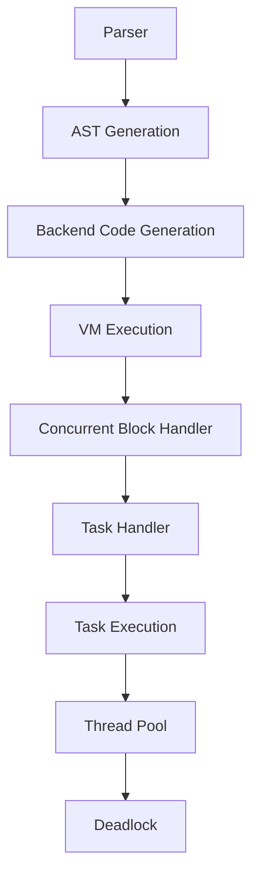
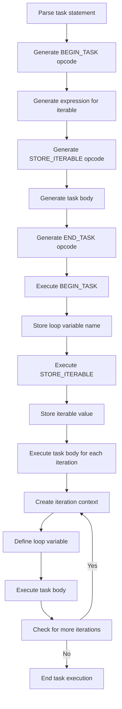

# Concurrent Task Iteration Fix Design Document

## 1. Overview

This document outlines the design and implementation approach to fix the concurrent task iteration deadlock issue in the Limitly programming language. The problem occurs when using `task(i in 1..3)` within a `concurrent` block, causing a resource deadlock error during execution.

## 2. Problem Analysis

### 2.1 Issue Description

When executing the following code:
```limitly
var counters: atomic = 0;
concurrent(mode=batch, cores=Auto, on_error=Auto) {
    // Task statement for parallel execution
    task(i in 1..3) {
        counters += 1;
        print("Task {counters} running");
    }
}
```

The program produces the following output before crashing with a resource deadlock error:
```
[DEBUG] Starting concurrent block, mode: async
[DEBUG] Concurrent task starting execution
[DEBUG] Beginning task with loop variable: i
[DEBUG] Storing iterable for task iteration
Task 1 running
[DEBUG] Ending task
[DEBUG] Concurrent task completed
terminate called after throwing an instance of 'std::system_error'
  what():  Resource deadlock avoided
```

### 2.2 Root Cause

The root cause of the issue is in the task iteration implementation within the VM. The current implementation has several problems:

1. **Incomplete Task Iteration Logic**: The `handleStoreIterable` function simply stores the iterable on the stack but doesn't properly set up the iteration mechanism for tasks.

2. **Missing Task Execution Context**: When a task with iteration is executed, the VM doesn't properly create separate execution contexts for each iteration, leading to resource contention.

3. **Concurrency Runtime Integration**: The task iteration mechanism doesn't properly integrate with the concurrency runtime components (scheduler, thread pool, event loop).

4. **Scope Management**: Task variables are not properly scoped, causing conflicts when multiple tasks access shared resources.

5. **Iterator Management**: The VM lacks proper iterator creation and management for task iterations.

## 3. Architecture

### 3.1 Current Implementation Flow



### 3.2 Issues in Current Flow

1. **Task Handler**: The `handleBeginTask` and `handleStoreIterable` functions don't properly implement task iteration logic.
2. **Task Execution**: The task execution context doesn't handle iteration variables correctly.
3. **Resource Management**: Shared resources (like atomic counters) are not properly synchronized across task iterations.
4. **Iterator Management**: The VM lacks proper iterator creation and management for task iterations.

## 4. Solution Design

### 4.1 Task Iteration Implementation

The solution involves properly implementing the task iteration mechanism in the VM:

1. **Enhanced Task Handler**: Modify `handleBeginTask` to properly set up iteration context when a loop variable is present.

2. **Iterable Storage**: Enhance `handleStoreIterable` to store the iterable in a way that can be accessed by task iterations.

3. **Task Execution Context**: Modify the task execution logic to create separate contexts for each iteration.

### 4.2 Detailed Implementation

#### 4.2.1 Task Handler Enhancement

```cpp
void VM::handleBeginTask(const Instruction& instruction) {
    bool isAsync = instruction.intValue != 0;
    std::string loopVar = instruction.stringValue;
    
    if (!loopVar.empty()) {
        // Store loop variable name for later use
        currentTaskLoopVar = loopVar;
        
        if (debugMode) {
            std::cout << "[DEBUG] Beginning task iteration with loop variable: " << loopVar << std::endl;
        }
    } else {
        if (debugMode) {
            std::cout << "[DEBUG] Beginning simple task" << (isAsync ? " (async)" : "") << std::endl;
        }
    }
    
    // Create a new scope for the task
    handleBeginScope(instruction);
}
```

#### 4.2.2 Iterable Storage Enhancement

```cpp
void VM::handleStoreIterable(const Instruction& instruction) {
    // Pop the iterable from the stack
    ValuePtr iterable = pop();
    
    // Store the iterable for task iteration
    currentTaskIterable = iterable;
    
    if (debugMode) {
        std::cout << "[DEBUG] Storing iterable for task iteration" << std::endl;
    }
}
```

#### 4.2.3 Task Execution Context Enhancement

The task execution logic in `handleBeginConcurrent` needs to be enhanced to properly handle task iterations:

```cpp
// In handleBeginConcurrent, when creating tasks:
Task task = [this, block_bytecode, mode, taskIterable, taskLoopVar]() {
    try {
        // Create a new VM for this task
        VM task_vm(false);
        
        // Share concurrency components
        task_vm.scheduler = this->scheduler;
        task_vm.thread_pool = this->thread_pool;
        task_vm.event_loop = this->event_loop;
        
        // Set up environment
        task_vm.globals = this->globals;
        task_vm.environment = std::make_shared<Environment>(this->environment);
        
        // Handle task iteration if applicable
        if (taskIterable && !taskLoopVar.empty()) {
            // Create iterator for the iterable
            auto iterator = createIterator(taskIterable);
            
            // Execute task for each iteration
            while (hasNext(iterator)) {
                auto value = next(iterator);
                
                // Create a new environment for this iteration
                auto iterationEnv = std::make_shared<Environment>(task_vm.environment);
                iterationEnv->define(taskLoopVar, value);
                
                // Execute the task with this iteration's environment
                task_vm.environment = iterationEnv;
                task_vm.execute(block_bytecode);
            }
        } else {
            // Execute simple task
            task_vm.execute(block_bytecode);
        }
        
        if (debugMode) {
            std::cout << "[DEBUG] Task completed" << std::endl;
        }
    } catch (const std::exception& e) {
        std::cerr << "[ERROR] Task failed: " << e.what() << std::endl;
    }
};
```

This approach ensures that each iteration of a task runs in its own isolated environment with the correct loop variable value, preventing resource contention and deadlocks.

## 5. Data Models

### 5.1 Task Execution Context

The enhanced task execution requires additional context data:

```cpp
struct TaskContext {
    std::string loopVar;           // Loop variable name for iteration tasks
    ValuePtr iterable;             // Iterable for iteration tasks
    std::shared_ptr<Iterator> iterator; // Iterator for the iterable
    bool hasNext;                  // Whether there are more iterations
    ValuePtr currentValue;         // Current iteration value
};
```

### 5.2 VM State Extensions

The VM needs additional state to manage task iterations:

```cpp
class VM {
    // ... existing members ...
    
    // Task iteration state
    std::string currentTaskLoopVar;
    ValuePtr currentTaskIterable;
    
    // ... rest of class ...
};
```

These additions allow the VM to properly track and manage task iteration state throughout the execution lifecycle.

## 6. Business Logic

### 6.1 Task Iteration Flow



### 6.2 Concurrency Integration

The task iteration mechanism needs to properly integrate with the concurrency runtime:

1. **Thread Pool Usage**: Each task iteration should be submitted to the thread pool for execution.
2. **Resource Synchronization**: Shared resources (like atomic variables) must be properly synchronized.
3. **Error Handling**: Errors in individual task iterations should be handled according to the concurrency block's error policy.

## 7. Testing

### 7.1 Unit Tests

1. **Basic Task Iteration Test**: Verify that `task(i in 1..3)` executes correctly.
2. **Atomic Variable Test**: Ensure atomic variables are properly incremented across task iterations.
3. **Resource Contention Test**: Test multiple concurrent tasks accessing shared resources.
4. **Error Handling Test**: Verify error handling in task iterations.

### 7.2 Integration Tests

1. **Concurrent Block with Task Iteration**: Test the complete scenario from the issue report.
2. **Nested Task Iteration**: Test task iterations within nested concurrent blocks.
3. **Mixed Task Types**: Test concurrent blocks with both simple tasks and iteration tasks.

## 8. Implementation Plan

### 8.1 Phase 1: Core Implementation
1. Enhance `handleBeginTask` to properly set up task iteration context
2. Enhance `handleStoreIterable` to store iterables correctly
3. Implement iterator creation and management functions
4. Modify task execution logic to handle iterations

### 8.2 Phase 2: Concurrency Integration
1. Integrate task iterations with the thread pool
2. Implement proper resource synchronization
3. Add error handling for task iterations

### 8.3 Phase 3: Testing and Validation
1. Implement unit tests for task iteration functionality
2. Implement integration tests for concurrent blocks with task iterations
3. Validate the fix with the original problematic code

## 9. Risk Analysis

### 9.1 Potential Issues
1. **Performance Impact**: Creating separate execution contexts for each iteration might impact performance.
2. **Memory Usage**: Storing iterator state might increase memory usage.
3. **Thread Pool Overload**: Submitting too many iterations to the thread pool might cause resource exhaustion.
4. **Iterator Complexity**: Implementing proper iterator support for all iterable types (ranges, lists, etc.) adds complexity.

### 9.2 Mitigation Strategies
1. **Batch Processing**: Process iterations in batches to reduce thread pool overhead.
2. **Resource Limits**: Implement limits on concurrent task iterations.
3. **Memory Management**: Use efficient data structures for iterator state.
4. **Iterator Optimization**: Implement specialized iterators for common types like ranges to improve performance.

## 10. Conclusion

The concurrent task iteration deadlock issue in Limitly is caused by incomplete implementation of the task iteration mechanism in the VM. The solution involves properly implementing the task iteration logic, including enhanced task handlers, proper iterable storage, and correct task execution contexts. This will allow `task(i in 1..3)` statements to execute correctly within concurrent blocks without causing resource deadlocks.

The key to resolving this issue is ensuring that each task iteration runs in its own isolated environment with proper variable scoping, while still allowing access to shared resources like atomic variables through appropriate synchronization mechanisms. By implementing proper iterator management and execution context isolation, we can eliminate the resource contention that leads to the deadlock while maintaining the performance benefits of concurrent execution.