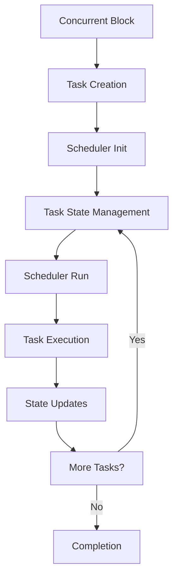

# Concurrency Models in Limitly

## Overview

Limitly implements **two distinct concurrency models** designed for different use cases:

1. **`parallel` blocks** - SharedCell-based data parallelism for CPU-bound work
2. **`concurrent` blocks** - Scheduler-based task parallelism for I/O-bound work

These models are **complementary**, not interchangeable. Each is optimized for specific types of workloads.

## Model Selection Flowchart

```
Is your workload I/O-bound or needs continuous processing?
├─ YES → Use `concurrent` (stream mode only)
│   └─ Event-driven processing with workers and channels
│
└─ NO → Is it CPU-bound batch computation?
    ├─ YES → Use `parallel` (batch mode only)
    │   └─ Fork-join processing with tasks and SharedCell
    │
    └─ NO → Simple sequential code
```

---

## Key Insights

### `parallel` (Batch Mode Only)

**Strengths:**
- ✅ **Zero-copy** shared memory via SharedCell
- ✅ **Automatic atomicity** for shared variables
- ✅ **Low overhead** (no scheduler)
- ✅ **Cache-efficient** for bulk data
- ✅ **Simple mental model** (fork-join)

**Weaknesses:**
- ❌ **No sleep/yield** support
- ❌ **No continuous processing**
- ❌ **No event-driven** execution
- ❌ **Fixed task count** (compile-time)
- ❌ **No worker statements**

**Best For:**
- Matrix operations
- Image/video processing
- Monte Carlo simulations
- Parallel aggregation
- Bulk data transforms

**Constructs:**
- ❌ `task` statements (use concurrent instead)
- ❌ `worker` statements (use concurrent instead)
- ✅ SharedCell for shared variables
- ✅ Direct parallel operations (no task/worker wrappers)

---

### `concurrent` (Stream Mode Only)

**Strengths:**
- ✅ **Continuous processing** of data streams
- ✅ **Event-driven** execution
- ✅ **Channel-based** communication
- ✅ **Both task and worker** statements
- ✅ **Pipeline** patterns

**Weaknesses:**
- ❌ **No shared variables** (channels only)
- ❌ **Message overhead** for small data
- ❌ **No batch processing** (use parallel instead)
- ❌ **No SharedCell** support

**Best For:**
- Web servers
- Stream processing
- Producer-consumer
- Event handling
- Real-time processing

**Constructs:**
- ✅ `task` statements (for discrete events)
- ✅ `worker` statements (for continuous streams)
- ❌ SharedCell (use channels instead)
- ✅ Channels for communication

---

### `parallel` (Batch Mode Only)

#### Minimal Syntax
```lm
// Fork-join data parallel work
parallel {
    // Direct code only - SharedCell operations
    iter(i in 0..999) {
        results[i] = compute_heavy_operation(data[i]);  // SharedCell access
    }
}
```

#### Full Syntax
```lm
parallel(
    cores = Auto | Int,
    timeout = Duration?,
    grace = Duration?,
    on_error = Stop | Continue | Partial
) {
    // Direct code only - SharedCell operations
    iter(i in 1..100) {
        matrix[i][j] = process_row(matrix_row[i]);  // SharedCell
    }
}
```

---

### `concurrent` (Stream Mode Only)

#### Simple Syntax
```lm
// Event-driven stream processing
var input = channel();
var output = channel();

concurrent(ch=input) {
    worker(event) {
        processed = handle_event(event);  // Channel communication
        output.send(processed);
    }
}

// Feed events to stream
input.send(event1);
input.send(event2);
```

#### With Parameters
```lm
concurrent(events=StreamEvent, ch=output, cores=Auto,
           on_error=Stop, timeout=60s, grace=500ms) {
    worker(event) {
        result = process_stream_event(event);  // Channel only
        output.send(result);
    }
}
```

---

## Combined Usage Example

### Real-world Scenario: Data Pipeline

```lm
// Stage 1: CPU-bound data processing (parallel)
var processed_data: array[10000];

parallel(cores=8, timeout=120s) {
    task(i in 0..9999) {
        processed_data[i] = heavy_computation(raw_data[i]);  // SharedCell
    }
}

print("Data processing complete");

// Stage 2: I/O-bound result distribution (concurrent)
var results = channel();

concurrent(ch=results, cores=4) {
    worker(data_chunk) {
        // Send to external services
        api_client.send(data_chunk);  // Channel communication
        database.store(data_chunk);
    }
}

// Stream processed results
iter (chunk in processed_data) {
    results.send(chunk);
}
```

### When to Combine Them

**Use both when:**
1. **CPU-intensive preprocessing** → `parallel` with SharedCell
2. **I/O-intensive distribution** → `concurrent` with channels
3. **Data pipeline stages** → Sequential parallel → concurrent blocks

**Example scenarios:**
- **Image processing pipeline**: Process images in parallel, then stream results
- **Data analytics**: Compute aggregations in parallel, then stream reports
- **Machine learning**: Batch model training, then real-time inference

---

## Parallel Blocks (SharedCell Model)

### Architecture

The `parallel` model uses **SharedCell abstraction** for safe shared variable access in CPU-bound parallel work.

#### Components

1. **LIR Generator** - Compiles parallel blocks into LIR instructions
2. **RegisterVM** - Executes LIR instructions with SharedCell operations
3. **SharedCell System** - Provides atomic shared variable access
4. **Work Queue System** - Lock-free task scheduling

#### Execution Model

```
Parallel Block {
    SharedCell Allocation → Task Creation → Work Queue → Worker Signal → Synchronization
}
```

---

## Concurrent Blocks (Scheduler Model)

### Architecture

The `concurrent` model uses a **task scheduler** with channel-based communication for I/O-bound and event-driven work.

#### Components

1. **Scheduler** - Time-based task scheduling with state management
2. **Task Context** - Individual task state and execution context
3. **Channel System** - Message passing for communication
4. **Event Loop** - Tick-based execution advancement

#### Execution Model

```
Concurrent Block {
    Task Creation → Scheduler Init → State Management → Event Loop → Channel Communication
}
```

### SharedCell Abstraction (Parallel Only)

### Design Principles

- **Identity**: Each shared variable gets a unique SharedCell ID
- **Isolation**: One SharedCell per variable per parallel block
- **Atomicity**: All SharedCell operations are atomic
- **Explicit**: Shared variable access is explicit in LIR

### LIR Operations

```lir
shared_cell_alloc rX          ; Allocate new SharedCell, return ID in rX
shared_cell_load rY, rX        ; Load value from SharedCell ID rX to rY  
shared_cell_store rX, rY       ; Store value rY to SharedCell ID rX
shared_cell_add rX, rY          ; Atomic add: SharedCell[rX] += rY
shared_cell_sub rX, rY          ; Atomic sub: SharedCell[rX] -= rY
```

### Task Function Pattern

```lir
; Task function receives SharedCell ID in register 3
task_get_field rA, ctx, 3        ; rA = SharedCell ID
shared_cell_load rB, rA          ; rB = current value
add rB, rB, 1                   ; increment
shared_cell_store rA, rB         ; store back to SharedCell
```

## RegisterVM Implementation

### SharedCell Table

```cpp
struct SharedCell {
    uint32_t id;
    std::atomic<int64_t> value;
};

std::vector<std::unique_ptr<SharedCell>> shared_cells;
```

### Execution Flow

1. **Allocation**: `shared_cell_alloc` creates new SharedCell in table
2. **Task Setup**: SharedCell ID stored in task context field 3
3. **Task Execution**: Tasks use SharedCell operations for variable access
4. **Synchronization**: Final values loaded back to main thread registers

### Work Queue System

```cpp
// Lock-free parallel execution
WorkQueueAlloc → WorkQueuePush → WorkerSignal → ParallelWaitComplete → WorkQueueFree
```

## Concurrency Constructs

### Parallel Blocks

#### Simple Syntax (Defaults Used)
```lm
// From test_concurrent_simple.lm
var counter1: int = 0;

parallel {
    task (i in 1..3) {
        print("Block 1 - Task", i, "starting");
        counter1 = counter1 + 1;
        print("Block 1 - Task", i, "done, counter1 =", counter1);
    }
}
```

#### Full Syntax (With Parameters)
```lm
// From tests/concurrency/concurrent_blocks.lm
var messages = channel();

parallel(ch=messages, mode=batch, cores=Auto, on_error=Auto,
         timeout=20s, grace=500ms, on_timeout=partial) {
    
    task(i in 1..3) {
        print("Task {i} running");
        sleep(randint(1, 3));
        messages.send("Task {i} done");
    }
} // auto-close messages

// Process messages from parallel tasks
iter (message in messages) {
    print("Received: {message}");
}
```

#### Stream Processing Example
```lm
// From tests/concurrency/concurrent_blocks.lm
var files_out = channel();

parallel(events: FileChunks, ch=files_out, mode=stream, cores=Auto,
         on_error=Retry, timeout=60s,
         grace=500ms, on_timeout=partial) {
    
    worker(chunk) {
        process_chunk(chunk);
        files_out.send("Chunk {chunk.id} processed");
    }
} // auto-close files_out

iter (msg in files_out) {
    print(msg);
}
```

### Concurrent Blocks

#### Simple Syntax (Defaults Used)
```lm
// From tests/concurrency/concurrent_blocks.lm
concurrent {
    task(i in 1..2) {
        print("Task {i} with default parameters");
    }
}
```

#### Full Syntax (With Parameters)
```lm
// From tests/concurrency/concurrent_blocks.lm
var shared_counter: int = 0;
var counts = channel();

concurrent(ch=counts, mode=batch, cores=Auto, on_error=Stop,
           timeout=20s, grace=500ms, on_timeout=partial) {
    
    task(i in 1..3) {
        print("Concurrent task {i} running");
        sleep(randint(1, 3));
        shared_counter += 1;  // atomic add
        counts.send(shared_counter);
    }
} // auto-close counts when done or timeout+grace reached

iter (count in counts) {
    print("Updated counter: {count}");
}
```

#### Stream Processing (I/O Bound)
```lm
// From tests/concurrency/concurrent_blocks.lm
var stream_out = channel();

concurrent(events: StreamEvent, ch=stream_out, mode=stream, cores=Auto,
           on_error=Stop, timeout=15s, grace=500ms, on_timeout=partial) {
    worker(event) {
        print("Processing event: {event}");
        stream_out.send("Handled {event.id}");
    }
} // auto-close stream_out

iter (msg in stream_out) {
    print("Result: {msg}");
}
```

#### Minimal Parameters (Smoke Test)
```lm
// From tests/concurrency/concurrency_smoke.lm
var counter: int = 0;

concurrent(mode=batch, cores=2, on_error=Stop) {
    task(i in 1..4) {
        counter += 1;
        print("Task running with counter {counter}");
    }
}

assert(counter == 4, "Counter should be 4 after running 4 tasks");
```

## Concurrent System Architecture

### Concurrent vs Parallel Blocks

| Aspect | Parallel Blocks | Concurrent Blocks |
|--------|------------------|-------------------|
| Scheduling | Work Queue + Worker Signal | Scheduler + Task States |
| Task Management | Work queue based | State machine based |
| Coordination | Barrier synchronization | Event-driven scheduling |
| Use Case | Data parallelism | Task parallelism |

### Concurrent Scheduler

#### Task States
```cpp
enum class TaskState {
    INIT,       // Task created, not started
    RUNNING,    // Task currently executing
    SLEEPING,   // Task waiting for condition
    COMPLETED   // Task finished execution
};
```

#### Scheduler Components
```cpp
struct Scheduler {
    std::vector<std::unique_ptr<TaskContext>> tasks;
    uint64_t current_time;
    uint64_t next_task_id;
    
    void add_task(std::unique_ptr<TaskContext> task);
    void tick();  // Advance simulation time
    bool has_running_tasks() const;
};
```

#### Task Context
```cpp
struct TaskContext {
    TaskState state;
    uint64_t task_id;
    uint64_t sleep_until;
    int64_t counter;
    RegisterValue channel_ptr;
    std::unordered_map<int, RegisterValue> fields;
    
    // Task execution bounds
    int64_t body_start_pc;
    int64_t body_end_pc;
};
```

### Concurrent Execution Flow



### Concurrent LIR Operations

#### Task Context Management
```lir
task_context_alloc rX           ; Allocate new task context
task_context_init rX, rY, rZ    ; Initialize with parameters
task_get_state rX, rY           ; Get task state
task_set_state rX, rY           ; Set task state
task_set_field rX, rY, rZ        ; Set task context field
task_get_field rX, rY, rZ        ; Get task context field
```

#### Scheduling Operations
```lir
scheduler_init                   ; Initialize scheduler
scheduler_run                    ; Run scheduler loop
scheduler_tick                   ; Advance simulation time
get_tick_count rX               ; Get current tick
delay_until rX                   ; Sleep until time
```

#### Channel Communication
```lir
channel_alloc rX                ; Allocate channel
channel_push rX, rY             ; Push value to channel
channel_pop rX, rY               ; Pop value from channel
channel_has_data rX              ; Check if channel has data
```

### Concurrent Task Pattern

```lir
; Task function for concurrent execution
function _task_12345(task_id, loop_var, channel, shared_cell_id) {
    ; Load current value from SharedCell
    task_get_field rA, ctx, 3        ; rA = shared_cell_id
    shared_cell_load rB, rA          ; rB = current value
    
    ; Perform computation
    add rB, rB, 1                   ; increment
    
    ; Store back to SharedCell
    shared_cell_store rA, rB         ; store result
    
    ; Return result
    ret rB
}
```

### Channel-Based Communication

#### Producer Pattern
```lm
// From tests/concurrency/concurrent_blocks.lm
var counts = channel();

concurrent(ch=counts, mode=batch, cores=Auto, on_error=Stop,
           timeout=20s, grace=500ms, on_timeout=partial) {
    
    task(i in 1..3) {
        print("Concurrent task {i} running");
        shared_counter += 1;  // atomic add
        counts.send(shared_counter);  // Send to channel
    }
} // auto-close counts when done

// Process results
iter (count in counts) {
    print("Updated counter: {count}");
}
```

#### LIR Channel Operations
```lir
; Channel allocation
channel_alloc r0                ; r0 = channel handle

; Producer task - send data
channel_push r0, r1             ; push r1 to channel r0

; Consumer task - receive data  
channel_pop r1, r0               ; r1 = pop from channel r0
channel_has_data r0              ; check if channel has data
```

### Scheduler Implementation

#### Time-Based Scheduling
```cpp
void Scheduler::tick() {
    current_time++;
    
    // Wake up sleeping tasks
    for (auto& task : tasks) {
        if (task->state == TaskState::SLEEPING && 
            current_time >= task->sleep_until) {
            task->state = TaskState::RUNNING;
        }
    }
}
```

#### Task Execution Loop
```cpp
bool Scheduler::has_running_tasks() const {
    for (const auto& task : tasks) {
        if (task->state != TaskState::COMPLETED) {
            return true;
        }
    }
    return false;
}
```

### Concurrent vs Parallel Performance

| Metric | Concurrent | Parallel |
|--------|-----------|----------|
| Task Granularity | Fine-grained | Coarse-grained |
| Communication | Channels | Shared memory |
| Scheduling | Event-driven | Barrier-based |
| Overhead | Higher per task | Lower per block |
| Flexibility | High | Medium |

### Concurrent Use Cases

#### ✅ Ideal For
1. **Pipeline Processing**: Producer-consumer patterns
2. **Event Handling**: Asynchronous event processing
3. **I/O Bound Tasks**: Non-blocking operations
4. **Message Passing**: Actor-like communication

#### ❌ Not Ideal For
1. **Data Parallelism**: Better with parallel blocks
2. **Tight Coupling**: Shared state coordination
3. **High Throughput**: Parallel blocks are faster
4. **Simple Computation**: Overkill for basic tasks

### Concurrent Error Handling

#### Task Lifecycle Management
```cpp
// Task completion
task->state = TaskState::COMPLETED;
task->function_name = nullptr;
task->body_start_pc = -1;
task->body_end_pc = -1;
```

#### Scheduler Rules
```cpp
// Skip completed tasks
if (task->state == TaskState::COMPLETED) continue;
if (!task->function_name) continue;
```

#### Error Recovery
```cpp
// Handle task execution errors
try {
    execute_task(task);
} catch (const std::exception& e) {
    task->state = TaskState::COMPLETED;  // Mark as failed
    log_error(task->task_id, e.what());
}
```

### Debugging Concurrent Code

#### Task Tracing
```cpp
std::cout << "[DEBUG] Task " << task->task_id 
          << " state: " << static_cast<int>(task->state) << std::endl;
```

#### Channel Monitoring
```cpp
std::cout << "[DEBUG] Channel " << channel_id 
          << " size: " << channel->size() << std::endl;
```

#### Scheduler State
```cpp
std::cout << "[DEBUG] Scheduler tick: " << current_time
          << " running tasks: " << count_running_tasks() << std::endl;
```

## Limitations

### ⚠️ Current Constraints

1. **Single Process**: No cross-process parallelism
2. **Coarse-grained**: Parallel blocks are the main unit of parallelism
3. **Memory Overhead**: SharedCell table grows with parallel blocks
4. **Synchronization**: Limited to simple barrier synchronization

### ⚠️ Performance Considerations

1. **Allocation Overhead**: SharedCell allocation per parallel block
2. **Atomic Operations**: SharedCell ops are atomic but not lock-free
3. **Work Queue Overhead**: Task scheduling has some cost
4. **Context Switching**: Task function calls have overhead

### LIR Configuration Handling

#### Parallel Block Configuration
```lm
// From tests/concurrency/parallel_blocks.lm
parallel(ch=messages, mode=batch, cores=Auto, on_error=Auto,
         timeout=20s, grace=500ms, on_timeout=partial) {
    // parallel block body
}
```

#### Concurrent Block Configuration
```lm
// From tests/concurrency/concurrent_blocks.lm
concurrent(ch=counts, mode=batch, cores=Auto, on_error=Stop,
           timeout=20s, grace=500ms, on_timeout=partial) {
    // concurrent block body
}
```

### LIR Configuration Processing

#### Configuration Extraction
```cpp
// In emit_parallel_stmt()
void Generator::emit_parallel_stmt(AST::ParallelStatement& stmt) {
    // Parse cores parameter
    int num_cores = 3;  // default
    if (!stmt.cores.empty() && stmt.cores != "auto") {
        try {
            num_cores = std::stoi(stmt.cores);
        } catch (...) {
            num_cores = 3;  // fallback
        }
    }
    
    // Parse timeout parameter
    uint64_t timeout_ms = 20000;  // 20 second default
    if (!stmt.timeout.empty()) {
        timeout_ms = parse_timeout(stmt.timeout);
    }
    
    // Parse grace period
    uint64_t grace_ms = 1000;  // 1 second default
    if (!stmt.grace.empty()) {
        grace_ms = parse_grace_period(stmt.grace);
    }
}
```

#### Configuration LIR Generation
```lir
; Configuration parsing and setup
load_const r0, 4                 ; cores = 4
load_const r1, 5000              ; timeout = 5000ms
load_const r2, 1000              ; grace = 1000ms

; Work queue allocation based on cores
work_queue_alloc r3, r0          ; allocate queue for 4 cores

; Timeout setup for parallel wait
load_const r4, 5000              ; timeout value
parallel_wait_complete r3, r4   ; wait with timeout
```

### Mode Handling

#### Fork-Join Mode (Parallel)
```lir
; Fork-Join execution pattern
work_queue_alloc r0, r1          ; allocate work queue
work_queue_push r0, task1        ; push task 1
work_queue_push r0, task2        ; push task 2
work_queue_push r0, task3        ; push task 3
work_queue_push r0, task4        ; push task 4

worker_signal r1, r0            ; execute all tasks
parallel_wait_complete r0, r5   ; wait for completion
work_queue_free r0              ; cleanup
```

#### Batch Mode (Concurrent)
```lir
; Batch execution pattern
scheduler_init                   ; initialize scheduler
scheduler_run                    ; run all tasks
scheduler_tick                   ; advance time
```

#### Stream Mode (Concurrent)
```lir
; Stream processing pattern
scheduler_init                   ; initialize scheduler
while channel_has_data ch {     ; while data available
    scheduler_run                ; process available tasks
    scheduler_tick               ; advance time
}
```

### Error Handling Strategies

#### Stop on Error
```lir
; Error handling in parallel execution
try {
    worker_signal r1, r0        ; execute tasks
} catch (const std::exception& e) {
    // Stop execution immediately
    work_queue_free r0          ; cleanup
    error("Parallel execution failed: " + e.what());
}
```

#### Retry on Error
```lir
; Retry logic for concurrent execution
scheduler_run                    ; attempt execution
if (scheduler_has_errors()) {
    scheduler_tick               ; advance time
    scheduler_run                ; retry failed tasks
}
```

#### Continue on Error
```lir
; Continue despite errors
scheduler_run                    ; execute tasks
scheduler_tick                   ; advance time
// Failed tasks are marked COMPLETED but execution continues
```

### Timeout Handling

#### Timeout Setup
```cpp
// Parse timeout from string
uint64_t parse_timeout(const std::string& timeout_str) {
    if (timeout_str.ends_with("ms")) {
        return std::stoull(timeout_str.substr(0, timeout_str.length() - 2));
    } else if (timeout_str.ends_with("s")) {
        return std::stoull(timeout_str.substr(0, timeout_str.length() - 1)) * 1000;
    }
    return 20000;  // 20 second default
}
```

#### Timeout LIR Generation
```lir
; Timeout value loading
load_const r0, 5000              ; 5 second timeout

; Parallel wait with timeout
parallel_wait_complete r0, r1   ; wait with timeout handling
```

#### Timeout Implementation
```cpp
// In RegisterVM parallel_wait_complete handler
OP_PARALLEL_WAIT_COMPLETE: {
    uint64_t queue_handle = to_int(registers[pc->a]);
    uint64_t timeout_ms = to_int(registers[pc->b]);
    
    // Start timeout monitoring
    auto start_time = std::chrono::high_resolution_clock::now();
    
    // Wait for completion or timeout
    while (!is_parallel_complete(queue_handle)) {
        auto elapsed = std::chrono::high_resolution_clock::now() - start_time;
        if (elapsed.count() > timeout_ms) {
            std::cout << "[ERROR] Parallel execution timeout after " 
                      << timeout_ms << "ms" << std::endl;
            break;
        }
        std::this_thread::sleep_for(std::chrono::milliseconds(10));
    }
}
```

### Grace Period Handling

#### Grace Period Purpose
- **Cleanup Time**: Allow tasks to finish cleanup operations
- **Resource Release**: Close channels, free memory
- **Final Synchronization**: Ensure shared state consistency

#### Grace Period Implementation
```cpp
// Grace period before timeout
void handle_grace_period(uint64_t grace_ms) {
    std::cout << "[INFO] Starting " << grace_ms << "ms grace period" << std::endl;
    
    auto start_time = std::chrono::high_resolution_clock::now();
    
    // Allow graceful shutdown
    while (has_active_tasks() && 
           std::chrono::high_resolution_clock::now() - start_time < 
           std::chrono::milliseconds(grace_ms)) {
        std::this_thread::sleep_for(std::chrono::milliseconds(10));
        // Allow tasks to complete cleanup
    }
}
```

### Core Detection

#### Auto Core Detection
```cpp
// Automatic core detection
int detect_available_cores() {
    return std::thread::hardware_concurrency();
}

// Core configuration in LIR generation
int num_cores = stmt.cores == "auto" ? 
    detect_available_cores() : 
    std::stoi(stmt.cores);
```

#### Core Allocation Logic
```lir
; Core detection and allocation
detect_cores r0                ; r0 = available cores
work_queue_alloc r1, r0          ; allocate queue for detected cores
```

### Channel Parameter Handling

#### Channel Declaration
```lm
concurrent (ch=channel) {
    // channel-based communication
}
```

#### Channel Setup in LIR
```cpp
// Channel parameter parsing
std::string channel_name = stmt.channel;
std::string channel_param = stmt.channelParam;  // e.g., "ch=counts"

// Channel allocation and setup
Reg channel_reg = allocate_register();
emit_instruction(LIR_Inst(LIR_Op::ChannelAlloc, Type::Ptr, channel_reg, 0, 0));

// Bind channel parameter if specified
if (!channel_param.empty()) {
    bind_variable(channel_param, channel_reg);
}
```

### Configuration Validation

#### Parameter Validation
```cpp
// Validate configuration parameters
void validate_parallel_config(const AST::ParallelStatement& stmt) {
    if (stmt.cores.empty() || stmt.cores == "auto") {
        // Auto-detect cores - always valid
        return;
    }
    
    int cores = std::stoi(stmt.cores);
    if (cores <= 0 || cores > 256) {
        throw std::runtime_error("Invalid cores parameter: " + stmt.cores);
    }
    
    if (!stmt.timeout.empty()) {
        uint64_t timeout = parse_timeout(stmt.timeout);
        if (timeout == 0 || timeout > 300000) {  // 5 minute max
            throw std::runtime_error("Invalid timeout parameter: " + stmt.timeout);
        }
    }
}
```

#### Error Reporting
```cpp
// Configuration error handling
try {
    emit_parallel_stmt(stmt);
} catch (const std::exception& e) {
    std::cerr << "Configuration Error: " << e.what() << std::endl;
    std::cerr << "  cores: " << stmt.cores << std::endl;
    std::cerr << "  mode: " << stmt.mode << std::endl;
    std::cerr <<  " timeout: " << stmt.timeout << std::endl;
    std::cerr << "  grace: " << stmt.grace << std::endl;
}
```

### Runtime Configuration

#### Dynamic Core Adjustment
```cpp
// Adjust core count at runtime
void set_core_count(int new_cores) {
    if (new_cores > 0 && new_cores <= max_cores) {
        current_cores = new_cores;
        resize_work_pools(new_cores);
    }
}
```

#### Timeout Adjustment
```cpp
// Dynamic timeout adjustment
void set_timeout(uint64_t timeout_ms) {
    current_timeout = timeout_ms;
    std::cout << "[CONFIG] Timeout set to " << timeout_ms << "ms" << std::endl;
}
```

## Optimizations

### 🚀 Future Improvements

#### 1. Lock-Free SharedCell
```cpp
struct SharedCell {
    std::atomic<int64_t> value;
    // Use lock-free algorithms for add/sub
};
```

#### 2. SharedCell Pool
```cpp
// Pre-allocate SharedCell pool
class SharedCellPool {
    std::vector<SharedCell> pool;
    std::atomic<uint32_t> next_id;
};
```

#### 3. Work Queue Optimization
```cpp
// Use lock-free queues
template<typename T>
class LockFreeQueue {
    std::atomic<Node*> head;
    std::atomic<Node*> tail;
};
```

#### 4. Task Function Caching
```cpp
// Cache compiled task functions
class TaskFunctionCache {
    std::unordered_map<std::string, LIR_Function*> cache;
};
```

#### 5. SIMD Operations
```cpp
// Vectorized SharedCell operations
void shared_cell_add_batch(const std::vector<uint32_t>& ids, const std::vector<int64_t>& values);
```

## Memory Model

### SharedCell Lifecycle

1. **Allocation**: Created during parallel block compilation
2. **Usage**: Accessed by tasks via atomic operations
3. **Synchronization**: Values synchronized back to main thread
4. **Cleanup**: Cleared when VM resets

### Task Context

```cpp
struct TaskContext {
    uint64_t task_id;
    uint64_t body_start_pc;
    uint64_t body_end_pc;
    std::unordered_map<int, RegisterValue> fields;  // Field 3 = SharedCell ID
};
```

## Error Handling

### Concurrency Errors

1. **Invalid SharedCell ID**: Bounds checking in VM
2. **Task Function Not Found**: Graceful fallback
3. **Work Queue Overflow**: Queue size limits
4. **Timeout**: Parallel execution timeout handling

### Debug Support

```cpp
// Debug output for SharedCell operations
std::cout << "[DEBUG] SharedCell load: ID " << id << " -> value " << value << std::endl;
std::cout << "[DEBUG] SharedCell store: ID " << id << " <- value " << value << std::endl;
```

## Comparison with Other Models

### vs Traditional Threading

| Aspect | SharedCell Model | Traditional Threading |
|--------|------------------|----------------------|
| Complexity | Low | High |
| Safety | High (no races) | Low (races possible) |
| Debugging | Easy | Hard |
| Performance | Good | Better (with tuning) |
| Portability | High | Platform-dependent |

### vs Actor Model

| Aspect | SharedCell Model | Actor Model |
|--------|------------------|-------------|
| Communication | Shared memory | Message passing |
| Coupling | Medium | Low |
| Performance | Good | Variable |
| Simplicity | High | Medium |

## Use Cases

### ✅ Ideal For

1. **Data Parallelism**: Map-reduce style operations
2. **Independent Tasks**: Embarrassingly parallel problems
3. **Shared State**: Moderate shared variable access
4. **Scientific Computing**: Numerical simulations

### ❌ Not Ideal For

1. **Fine-grained Parallelism**: Too much overhead
2. **Complex Synchronization**: Limited coordination patterns
3. **Real-time Systems**: No timing guarantees
4. **Large-scale Distributed**: Single process only

## Future Directions

### 🎯 Roadmap

1. **Phase 1**: Optimize SharedCell operations (lock-free)
2. **Phase 2**: Add more synchronization primitives
3. **Phase 3**: Implement work-stealing scheduler
4. **Phase 4**: Add NUMA awareness
5. **Phase 5**: GPU offloading support

### 🔬 Research Areas

1. **Hybrid Models**: Combine SharedCell with message passing
2. **Type System**: Compile-time race detection
3. **Auto-parallelization**: Automatic parallel block detection
4. **Performance Modeling**: Predict parallel speedup
5. **Formal Verification**: Prove correctness properties

## Model Selection Flowchart

```
Is your workload I/O-bound or needs sleep/delay?
├─ YES → Use `concurrent`
│   ├─ Async I/O? → `concurrent mode=async`
│   ├─ Streams? → `concurrent mode=stream`
│   └─ Batch? → `concurrent mode=batch`
│
└─ NO → Is it CPU-bound computation?
    ├─ YES → Do you need shared state?
    │   ├─ YES → Use `parallel` with SharedCell
    │   └─ NO → Use `parallel` with channels
    │
    └─ NO → Simple sequential code
```

---

## Key Insights

### `parallel` (SharedCell) Model

**Strengths:**
- ✅ **Zero-copy** shared memory
- ✅ **Automatic atomicity** for shared variables
- ✅ **Low overhead** (no scheduler)
- ✅ **Cache-efficient** for bulk data
- ✅ **Simple mental model** (fork-join)

**Weaknesses:**
- ❌ **No sleep/yield** support
- ❌ **No async I/O** support
- ❌ **Barrier only** synchronization
- ❌ **Fixed task count** (compile-time)
- ❌ **No task states** (just run/done)

**Best For:**
- Matrix operations
- Image/video processing
- Monte Carlo simulations
- Parallel aggregation
- Bulk data transforms

---

### `concurrent` (Scheduler) Model

**Strengths:**
- ✅ **Sleep/delay** support
- ✅ **Async/await** I/O
- ✅ **Event-driven** execution
- ✅ **Flexible** task states
- ✅ **Pipeline** patterns

**Weaknesses:**
- ❌ **No shared variables** (channels only)
- ❌ **Message overhead** for small data
- ❌ **Scheduler overhead** (tick loop)
- ❌ **More complex** mental model
- ❌ **Serial** message processing

**Best For:**
- Web servers
- Stream processing
- Producer-consumer
- Async I/O tasks
- Timed/delayed execution

---
## Conclusion

Luminar's dual concurrency models are **complementary**, not competitive:

1. **`parallel` (SharedCell)** = Fork-join data parallelism
   - Like: OpenMP, Rayon, Intel TBB
   - Use for: CPU-bound bulk data

2. **`concurrent` (Scheduler)** = CSP-style task parallelism
   - Like: Go channels, Erlang actors
   - Use for: I/O-bound async work

**Together**, they cover most concurrency needs without conflicting. The key is choosing the right tool for the job:
- **Compute-heavy?** → `parallel`
- **I/O-heavy?** → `concurrent`
- **Both?** → Combine them!

This design is actually **stronger** than a single unified model because each is optimized for its specific use case.
